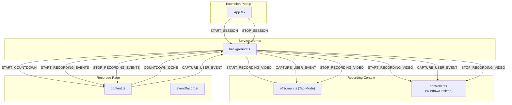
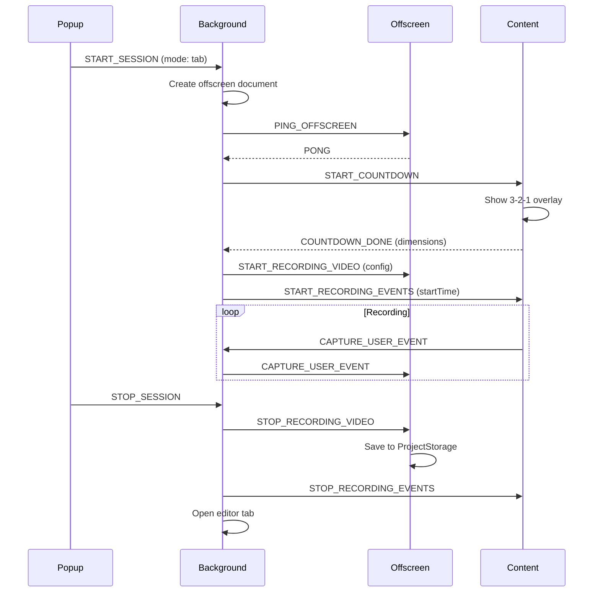
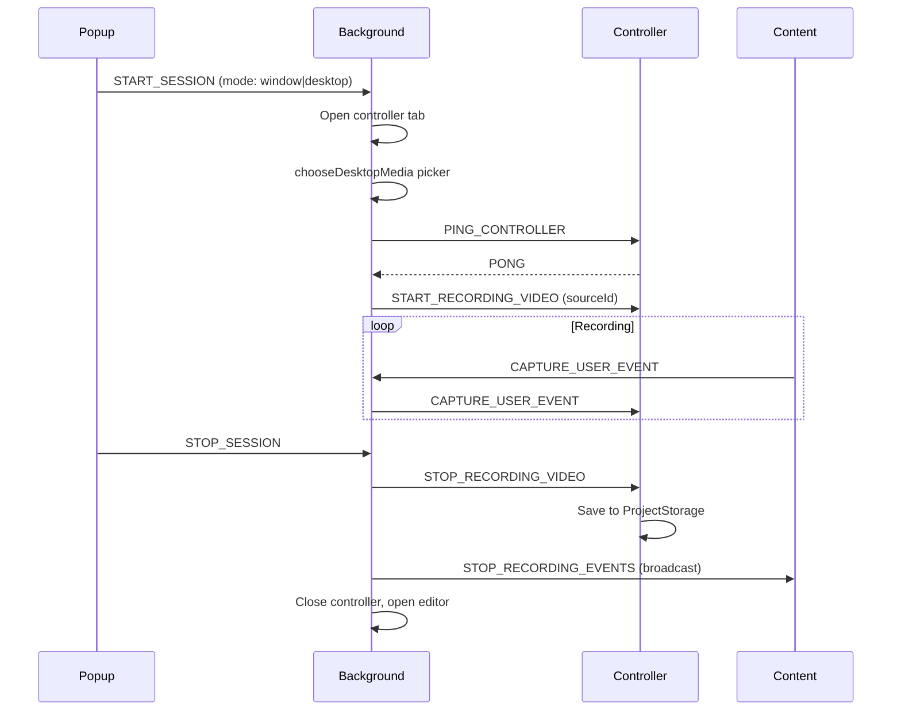

# Recording Communication Flow

Message flow between extension contexts during recording lifecycle.

## Architecture Overview

---

## Message Sequence (Tab Mode)

---

## Message Sequence (Window/Desktop Mode)

---

## Message Types Reference

| Message | Direction | Purpose |
|---------|-----------|---------|
| `START_SESSION` | Popup → Background | Initiate recording |
| `STOP_SESSION` | Popup → Background | End recording |
| `START_COUNTDOWN` | Background → Content | Begin 3-2-1 countdown |
| `COUNTDOWN_DONE` | Content → Background | Report viewport dimensions |
| `START_RECORDING_VIDEO` | Background → Offscreen/Controller | Start MediaRecorder |
| `STOP_RECORDING_VIDEO` | Background → Offscreen/Controller | Stop and save video |
| `START_RECORDING_EVENTS` | Background → Content | Start EventRecorder |
| `STOP_RECORDING_EVENTS` | Background → Content | Stop event capture |
| `CAPTURE_USER_EVENT` | Content → Background → Recorder | Forward user event |
| `PING_OFFSCREEN` | Background → Offscreen | Health check |
| `PING_CONTROLLER` | Background → Controller | Health check |
| `GET_RECORDING_STATE` | Any → Background | Query current state |
